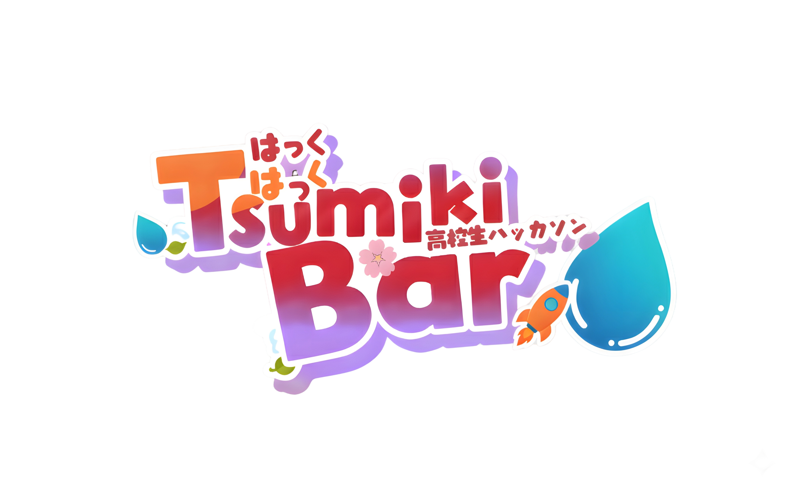
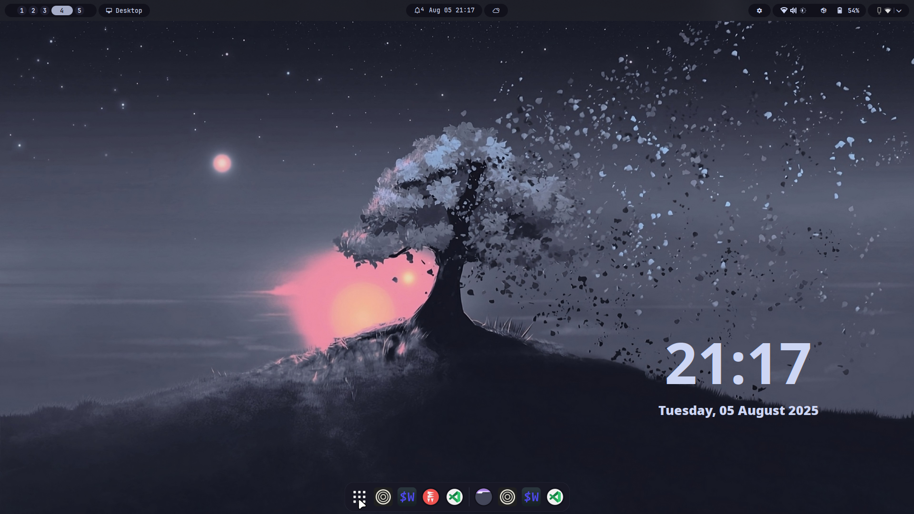
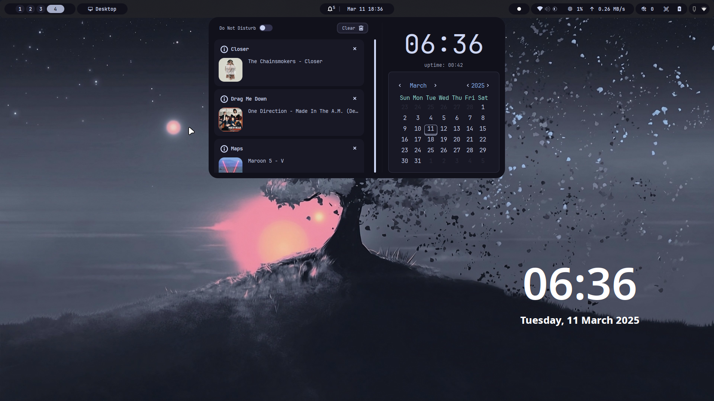
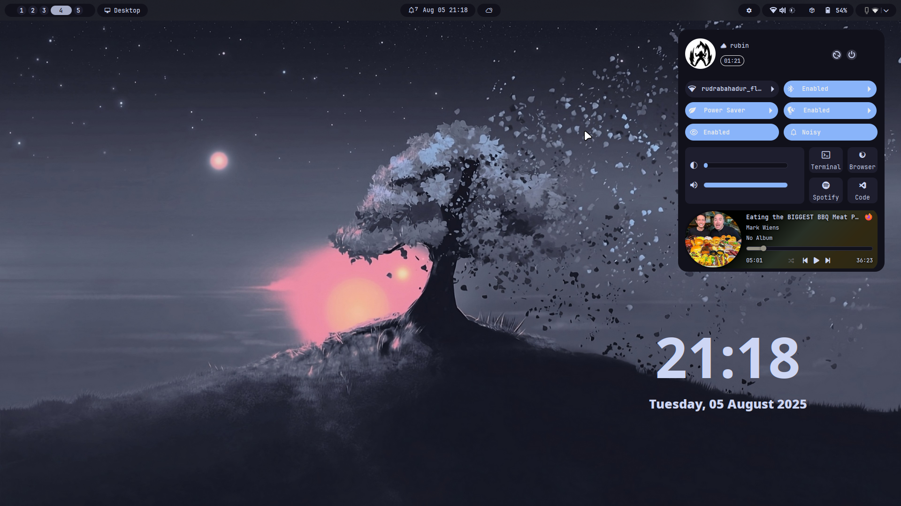
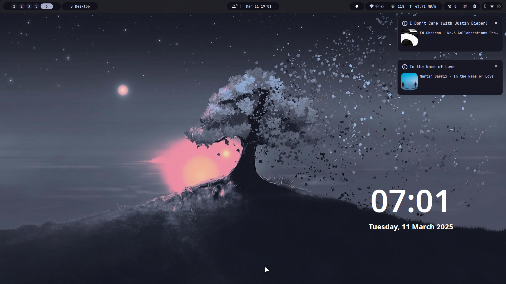
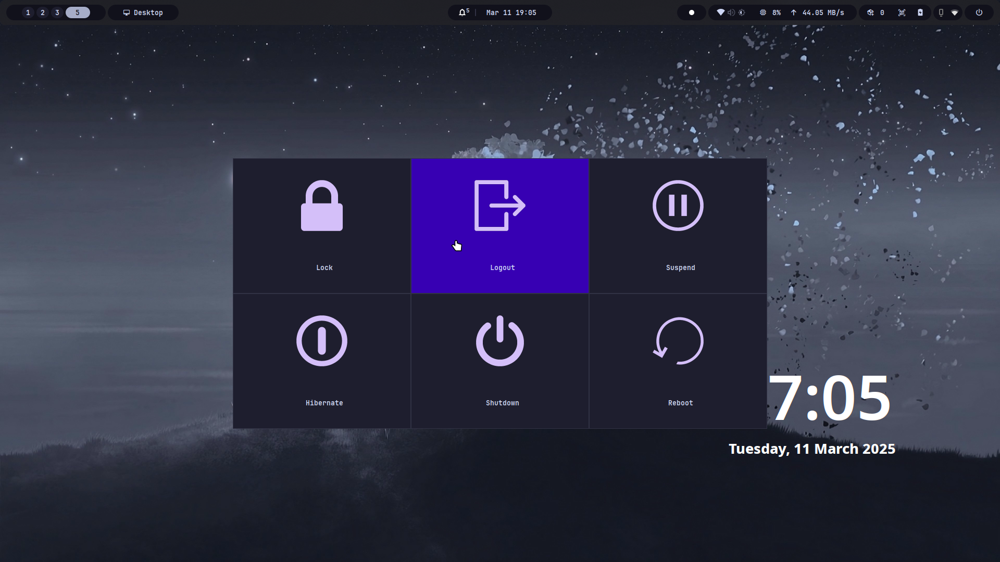
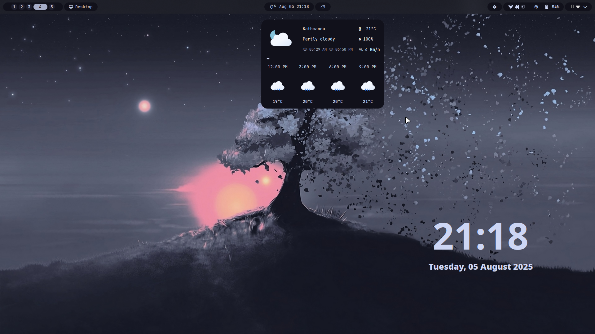

  

<h1 align="center">Tsumiki</h1>

  <em>A modular status bar for Hyprland, built on Fabric.</em>

  
  
  
  
  
  

  <b><a href="#quick-start">Quick Start</a></b>
  ·
  <b><a href="https://tsumikii.pages.dev">Documentation</a></b>
  ·
  <b><a href="#contributing">Contributing</a></b>
  ·
  <b><a href="#license">License</a></b>

> _No, this isn't Waybar. Yes, it's written in Python. Yes, it's still fast._ 🐍

**Tsumiki** (積み木 — Japanese for "building blocks") is a modular status bar for the [Hyprland](https://hyprland.org) Wayland compositor. Built on [Fabric](https://github.com/Fabric-Development/fabric), it offers a flexible, widget-based architecture for creating custom desktop panels — lightweight, performant, and deeply configurable.

---

## Screenshots

<table align="center">
  <tr>
    <td colspan="4"></td>
  </tr>
  <tr>
    <td colspan="4"></td>
  </tr>
  <tr>
    <td></td>
    <td></td>
    <td align="center"></td>
    <td align="center"></td>
  </tr>
</table>

## Features

- **Hyprland-native** — Full integration with Hyprland's ecosystem and event model.
- **Modular widget system** — 45+ widgets: workspaces, system tray, media, battery, CPU, weather, dock, launcher, and more.
- **Fully themeable** — Customize every element with SCSS; generate dynamic [Material You](https://github.com/InioX/matugen) color schemes from your wallpaper.
- **Highly configurable** — TOML-based configuration with hot-reload. Control layout, behavior, and appearance of every widget.
- **Notification system** — Built-in notification daemon with Do Not Disturb, grouping, and history persistence.
- **On-screen displays** — OSD overlays for volume, brightness, microphone, and lock keys.
- **Lightweight & fast** — Designed for minimal memory and CPU overhead.

## Documentation

Full documentation is available at **[tsumikii.pages.dev](https://tsumikii.pages.dev)**:

| Section                                                                   | Description                             |
| ------------------------------------------------------------------------- | --------------------------------------- |
| [Getting Started](https://tsumikii.pages.dev/en/getting-started/overview) | Overview, installation, first steps     |
| [Configuration](https://tsumikii.pages.dev/en/configuring/config)         | Layout, widget options, modules         |
| [Widgets Reference](https://tsumikii.pages.dev/en/features/widgets)       | Complete widget configuration reference |
| [Modules Reference](https://tsumikii.pages.dev/en/features/modules)       | Bar, dock, notifications, launcher, OSD |
| [Theming](https://tsumikii.pages.dev/en/theming/making-themes)            | SCSS customization, Matugen, tips       |
| [FAQ & Troubleshooting](https://tsumikii.pages.dev/en/help/faq)           | Common issues and solutions             |
| [Post-Installation](https://tsumikii.pages.dev/en/resources/post-install) | Hyprland layer rules for effects        |

## Support the Project

  

## Contributing

We welcome contributions of all sizes. Please see the [contributing guidelines](CONTRIBUTING.md) before opening a pull request.

## Acknowledgements

- **[Waybar](https://github.com/Alexays/Waybar)** — Initial inspiration.
- **[Hyprpanel](https://github.com/Jas-SinghFSU/HyprPanel)** — Design and feature inspiration.

Special thanks to [darsh](https://github.com/its-darsh) (creator of Fabric), [gummy bear album](https://github.com/muhchaudhary), [axenide](https://github.com/Axenide), [sankalp](https://github.com/S4NKALP) for code contributions, bug fixes, and design ideas.

## Contributors

Thanks to all contributors ([emoji key](https://allcontributors.org/docs/en/emoji-key)):

<!-- ALL-CONTRIBUTORS-LIST:START - Do not remove or modify this section -->
<!-- prettier-ignore-start -->
<!-- markdownlint-disable -->
<table>
  <tbody>
    <tr>
      <td align="center" valign="top" width="14.28%"><a href="https://github.com/PixelKhaos"> <b>Robin Seger</b></a> <a href="https://github.com/rubiin/tsumiki/commits?author=PixelKhaos" title="Code">💻</a> <a href="#design-PixelKhaos" title="Design">🎨</a></td>
      <td align="center" valign="top" width="14.28%"><a href="https://zaap.bio/Axenide"> <b>Adriano Tisera</b></a> <a href="https://github.com/rubiin/tsumiki/commits?author=Axenide" title="Code">💻</a> <a href="https://github.com/rubiin/tsumiki/issues?q=author%3AAxenide" title="Bug reports">🐛</a></td>
      <td align="center" valign="top" width="14.28%"><a href="https://github.com/Anshul-007"> <b>Anshul J.</b></a> <a href="https://github.com/rubiin/tsumiki/commits?author=Anshul-007" title="Code">💻</a> <a href="https://github.com/rubiin/tsumiki/issues?q=author%3AAnshul-007" title="Bug reports">🐛</a></td>
      <td align="center" valign="top" width="14.28%"><a href="https://github.com/S4NKALP"> <b>Sankalp Tharu</b></a> <a href="https://github.com/rubiin/tsumiki/commits?author=S4NKALP" title="Code">💻</a> <a href="https://github.com/rubiin/tsumiki/issues?q=author%3AS4NKALP" title="Bug reports">🐛</a></td>
      <td align="center" valign="top" width="14.28%"><a href="https://github.com/keepo-dot"> <b>Keepo</b></a> <a href="https://github.com/rubiin/tsumiki/commits?author=keepo-dot" title="Code">💻</a></td>
      <td align="center" valign="top" width="14.28%"><a href="https://evrenos-dev.vercel.app/"> <b>Sayeed Mahmood Evrenos</b></a> <a href="https://github.com/rubiin/tsumiki/issues?q=author%3AEvren-os" title="Bug reports">🐛</a></td>
      <td align="center" valign="top" width="14.28%"><a href="http://xeyossr.github.io"> <b>xeyossr</b></a> <a href="https://github.com/rubiin/tsumiki/commits?author=xeyossr" title="Documentation">📖</a></td>
    </tr>
    <tr>
      <td align="center" valign="top" width="14.28%"><a href="https://dimflix-official.github.io/"> <b>DIMFLIX</b></a> <a href="https://github.com/rubiin/tsumiki/issues?q=author%3ADIMFLIX-OFFICIAL" title="Bug reports">🐛</a></td>
      <td align="center" valign="top" width="14.28%"><a href="https://github.com/jhakonen"> <b>Janne Hakonen</b></a> <a href="https://github.com/rubiin/tsumiki/commits?author=jhakonen" title="Code">💻</a> <a href="https://github.com/rubiin/tsumiki/issues?q=author%3Ajhakonen" title="Bug reports">🐛</a></td>
      <td align="center" valign="top" width="14.28%"><a href="https://github.com/fdev31"> <b>Fabien Devaux</b></a> <a href="https://github.com/rubiin/tsumiki/issues?q=author%3Afdev31" title="Bug reports">🐛</a></td>
      <td align="center" valign="top" width="14.28%"><a href="https://github.com/sudo-Tiz"> <b>Tiz</b></a> <a href="https://github.com/rubiin/tsumiki/commits?author=sudo-Tiz" title="Code">💻</a> <a href="https://github.com/rubiin/tsumiki/issues?q=author%3Asudo-Tiz" title="Bug reports">🐛</a> <a href="https://github.com/rubiin/tsumiki/commits?author=sudo-Tiz" title="Documentation">📖</a></td>
      <td align="center" valign="top" width="14.28%"><a href="https://github.com/N1xev"> <b>Alaa Elsamouly</b></a> <a href="https://github.com/rubiin/tsumiki/commits?author=N1xev" title="Documentation">📖</a></td>
      <td align="center" valign="top" width="14.28%"><a href="https://github.com/muhchaudhary"> <b>Muhammad Ahmad Chaudhary</b></a> <a href="https://github.com/rubiin/tsumiki/issues?q=author%3Amuhchaudhary" title="Bug reports">🐛</a></td>
    </tr>
  </tbody>
</table>
<!-- markdownlint-restore -->
<!-- prettier-ignore-end -->

This project follows the [all-contributors](https://github.com/all-contributors/all-contributors) specification. Contributions of any kind welcome!

## License

Distributed under the [GPL-3.0 License](https://github.com/rubiin/tsumiki/blob/master/LICENSE).

  ⭐ <strong>Star the repo</strong> if you find it useful!

