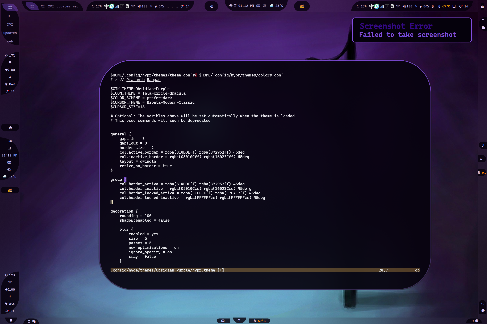
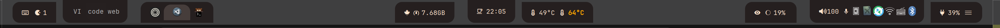

## Configuration Tree

```text
📂 ~/.config/waybar/
├── 📂 layouts/
├── 📂 menus/
├── 📂 modules/
├── 📂 styles/
├── 📂 includes/
├── 📄 config.jsonc
├── 📄 style.css
├── 📄 theme.css
└── 📄 user-style.css
```

- **config.jsonc**
  - Copy of a layout configuration. See [layouts](#layouts).
  - A transient file therefore edits must be saved at `~/.config/waybar/layouts/`
- **style.css**
  - Auto-generated file.
  - style.css imports 3 files:
    - **Current** `styles/*.css` that matches the `layout.jsonc`. See [styles](#styles)
    - **theme.css** generated by themes and this can override the selected style.
    - **user-style.css** is an optional file where you can add your own overrides. You can also test your CSS in here.

- **theme.css**
  - Theme generated file.

:::note
You should know that the `xdg_share/waybar` (~/.local/share/waybar) is a directory that is provided by HyDE. NEVER edit the files in this directory, as they will be overwritten on updates. You should instead edit your own `~/.config/waybar` directory! 

Take note that both have the same structure and I suggest you to copy the files from `xdg_share/waybar` to `~/.config/waybar` and edit them there.

:::

### Modules

Directory: `./modules/`

```text
└── 📂 modules/
   ├── 📄 backlight.jsonc
   ├── 📄 clock.jsonc
   ├── 📄 cpu.jsonc
   ├── 📄 custom-cpuinfo.jsonc
   ├── 📄 hyprland-language.jsonc
   ├── 📄 idle_inhibitor.jsonc
   ├── 📄 pulseaudio#microphone.jsonc
   ├── 📄 pulseaudio.jsonc
   ├── 📄 tray.jsonc
   ├── 📄 wlr-taskbar#windows.jsonc
   └── 📄 wlr-taskbar.jsonc
```

- Store all modules in `~/.config/waybar/modules/`.
- Files in here are recursively added as entry in `includes/includes.jsonc`
- All modules under a specific tree will have the `parent-child` convention. Example: `custom/cpuinfo` will be converted into `custom-cpuinfo`. This is used to easily determine the class name in CSS without confusion.

Example:
```css
.custom-cpuinfo {
  padding: 1em;
}
```

### Layouts

Directory: `./layouts/`

```text
└── 📂 layouts/
   ├── 📄 layout-1.jsonc
   ├── 📄 layout-2.jsonc
   ├── 📄 khing.jsonc
   ├── 📄 macos.jsonc
   └── 📄 ....jsonc
```

HyDE stores all the ready-to-use configurations in the `layouts/` directory. These can be navigated using the `hyde-shell waybar` script.

:::note
If users accidentally configure `./waybar/config.jsonc`, it will be moved to `~/.config/waybar/layouts/backup/name_timestamp.jsonc`. Even with these measures, we encourage creating a copy of your configuration in `~/.config/waybar/layouts/`.
:::

For CSS styling of the layouts see [styles](#styles).

### Styles

Directory: `./styles/`

```text
└── 📂 styles/
   └── 📂 groups/
   ├── 📄 layout-1.css
   ├── 📄 layout-2.css
   ├── 📄 khing.css
   ├── 📄 macos.css
   └── 📄 ...*.css
```

The `styles/` directory contains the counterpart CSS files for layouts.
When choosing a layout, HyDE will try to use the equivalent CSS style by matching the base names e.g. `khing.jsonc` will use `khing.css`.

Explicit `--config <file>` and `--style <file>` options are also supported.

### Includes

Directory: `./includes/`

```text
└── 📂 includes/
   ├── 📄 includes.jsonc
   ├── 📄 border-radius.css
   └── 📄 global.css
```

- **border-radius.css**
  - Dynamic border radius for the [groups](#groups).

#### Dynamic Border-Radius Preview

**No Rounding** in Hyprland


**Squircle** 10 rounding in Hyprland


**Circle** 100 rounding in Hyprland



**Get the Idea?**

- **global.css** - Includes the dynamic font-size and font-family. This is dynamic so that themes can override these values via the `hypr.theme` >> `$BAR_FONT`

### Menus

Directory: `./menus/`

Stores all the GTK Object XML files. To correctly manage the files we added the GObject XML files in `~/.config/waybar/menus/`

## Group Class for Styling

You should know that Waybar ONLY provides 3 positioning options for the modules: `modules-left`, `modules-center` and `modules-right`. To achieve the desired positioning or the popular pill effect, we need to use the `group` class.

For example:


Contents of `../waybar/styles/groups/` are used for styling the border-radius of the given group. Groups are the combination of modules - some call them islands.

In HyDE, to be able to make use of the groups, we can declare modules in a group first:

Example in `~/.config/waybar/layouts/my_config.jsonc`:

```jsonc
{
  "group/pill": {
    "orientation": "inherit",
    "modules": [
      "custom/gpuinfo",
      "clock"
    ]
  }
}
```

Now we can add the group in the waybar modules:

```jsonc
{
  "modules-center": [
    "group/pill",
    "group/pill#tag1",
    "group/pill-in"
  ]
}
```

**Styling** this is easy as we already group the modules. In this way we can use the group name as the class name:

```css
#pill,
#pill-in {
  /* Your styles here */
}
```

**Note:** `pill` and `pill#tag*` have a class name of `pill`. This is waybar convention to enable users to add a similar module but sharing common class name.


## Making your own waybar layout

:::note

This is a very shallow guide. You should follow the [waybar Wiki](https://github.com/Alexays/Waybar/wiki/Configuration) for more information.

:::


### This is the full layout file used for the instructions

<details open>
  <summary>MyBar.jsonc</summary>

```jsonc
{
  /* 
  ┌─────────────────────────────────────────────────────────────────────────────┐
  │     Global Options for the Waybar configuration                             │
  └─────────────────────────────────────────────────────────────────────────────┘
 */

  "layer": "top",
  "output": ["*"],
  "position": "top",
  "reload_style_on_change": true,

  /* 
  ┌────────────────────────────────────────────────────────────────────────────┐
  │                                                                            │
  │ This is one of the vital part of the configuration, it allows you to       │
  │ include other                                                              │
  │ files                                                                      │
  │ The `"$XDG_CONFIG_HOME/waybar/includes/includes.json"` is auto generated   │
  │ by the waybar.py                                                           │
  │ script.                                                                    │
  │ 1. Includes all the modules in `./waybar/modules`                          │
  │ 2. Resolves all the size for the icons that the style.css in waybar        │
  │ CANNOT                                                                     │
  │ handle                                                                     │
  │ 3. Of course this is optional, you can remove it if you don't want to use  │
  │ it and                                                                     │
  │ include your own set of modules.                                           │
  │                                                                            │
  └────────────────────────────────────────────────────────────────────────────┘
 */

  "include": ["$XDG_CONFIG_HOME/waybar/includes/includes.json"],

  /* 
  ┌────────────────────────────────────────────────────────────────────────────┐
  │ Declare the modules inside your desired group shapes                       │
  │  As of now we have:                                                        │
  │                                                                            │
  │ - pill-left - the curve is facing left                                     │
  │ - pill-right - the curve is facing right                                   │
  │ - pill-up - the curve is facing up                                         │
  │ - pill-down - the curve is facing down                                     │
  │ - pill-in - the curve is facing inwards no matter the position             │
  │ - pill-out - the curve is facing outwards no matter the position           │
  │ - leaf - a leaf shape                                                      │
  │ - leaf-inverse - a leaf shape but inverted                                 │
  │                                                                            │
  └────────────────────────────────────────────────────────────────────────────┘
 */

  "group/pill-left": {
    "orientation": "inherit",
    "modules": ["custom/keybindhint", "custom/updates"]
  },
  "group/pill-right": {
    "orientation": "inherit",
    "modules": ["battery", "custom/hyde-menu"]
  },
  "group/pill-up": {
    "orientation": "inherit",
    "modules": ["wlr/taskbar"]
  },
  "group/pill-down": {
    "orientation": "inherit",
    "modules": ["hyprland/workspaces"]
  },
  "group/pill-in": {
    "orientation": "inherit",
    "modules": ["idle_inhibitor", "clock"]
  },
  "group/pill-out": {
    "orientation": "inherit",
    "modules": ["custom/weather", "hyprland/language"]
  },
  "group/leaf": {
    "orientation": "inherit",
    "modules": ["custom/workflows", "memory"]
  },
  "group/leaf-inverse": {
    "orientation": "inherit",
    "modules": ["custom/gpuinfo", "custom/cpuinfo"]
  },

  /* 
  ┌─────────────────────────────────────────────────────────────────────────┐
  │ Re-using a group is simple, You just need to add a #tag to the group     │
  │ name.                                                                   │
  └─────────────────────────────────────────────────────────────────────────┘
 */

  "group/pill-down#right": {
    "orientation": "inherit",
    "modules": ["pulseaudio", "pulseaudio#microphone", "tray"]
  },
  "group/pill-up#right": {
    "orientation": "inherit",
    "modules": ["privacy", "custom/hyprsunset", "backlight#intel_backlight"]
  },

  /* 
  ┌────────────────────────────────────────────────────────────────────────────┐
  │                                                                            │
  │ Declare the groups in the module position provided by waybar               │
  │                                                                            │
  └────────────────────────────────────────────────────────────────────────────┘
 */
  "modules-left": ["group/pill-left", "group/pill-down", "group/pill-up"],
  "modules-center": ["group/leaf", "group/pill-in", "group/leaf-inverse"],
  "modules-right": [
    "group/pill-up#right",
    "group/pill-down#right",
    "group/pill-right"
  ]
}

```

</details>


### Step-by-Step Guide

#### Step 1: Create Your Configuration File

Start by creating a new file `~/.config/waybar/layouts/my_config.jsonc` or copy one of the existing ones from `~/.local/share/waybar/layouts/`.

```bash
cp ~/.local/share/waybar/layouts/layout-1.jsonc ~/.config/waybar/layouts/my_config.jsonc
```

#### Step 2: Add Global Configuration Options

Begin with the essential global configurations that define the basic behavior of your waybar:

```jsonc
{
  "layer": "top",                    // Position layer: "top" or "bottom"
  "output": ["*"],                   // Apply to all monitors (* means all outputs)
  "position": "top",                 // Bar position: top, bottom, left, right
  "reload_style_on_change": true,    // Auto-reload when style file changes
```

#### Step 3: Include HyDE Module Definitions

Add the include directive to automatically load all HyDE modules and configurations:

```jsonc
  "include": ["$XDG_CONFIG_HOME/waybar/includes/includes.json"],
```

:::tip
The `includes.json` file is auto-generated by HyDE's `hyde-shell waybar` script and provides:
- All modules from `./waybar/modules/`
- Icon size configurations that CSS cannot handle
- Dynamic configurations specific to HyDE
:::

#### Step 4: Define Group Shapes

HyDE provides several predefined group shapes for creating pill effects and custom layouts. Define your groups before assigning modules:

```jsonc
  // Available group shapes:
  // pill-left, pill-right, pill-up, pill-down
  // pill-in, pill-out, leaf, leaf-inverse
  
  "group/pill-left": {
    "orientation": "inherit",
    "modules": ["custom/keybindhint", "custom/updates"]
  },
  "group/pill-right": {
    "orientation": "inherit",
    "modules": ["battery", "custom/hyde-menu"]
  },
  "group/pill-up": {
    "orientation": "inherit",
    "modules": ["wlr/taskbar"]
  },
  "group/pill-down": {
    "orientation": "inherit",
    "modules": ["hyprland/workspaces"]
  },
  "group/pill-in": {
    "orientation": "inherit",
    "modules": ["idle_inhibitor", "clock"]
  },
  "group/pill-out": {
    "orientation": "inherit",
    "modules": ["custom/weather", "hyprland/language"]
  },
  "group/leaf": {
    "orientation": "inherit",
    "modules": ["custom/workflows", "memory"]
  },
  "group/leaf-inverse": {
    "orientation": "inherit",
    "modules": ["custom/gpuinfo", "custom/cpuinfo"]
  },
```

#### Step 5: Reuse Groups with Tags

You can reuse the same group shape multiple times by adding tags (`#tagname`):

```jsonc
  "group/pill-down#right": {
    "orientation": "inherit",
    "modules": ["pulseaudio", "pulseaudio#microphone", "tray"]
  },
  "group/pill-up#right": {
    "orientation": "inherit",
    "modules": ["privacy", "custom/hyprsunset", "backlight#intel_backlight"]
  },
```

#### Step 6: Arrange Groups in Module Positions

Finally, assign your groups to the three available positions:

```jsonc
  "modules-left": ["group/pill-left", "group/pill-down", "group/pill-up"],
  "modules-center": ["group/leaf", "group/pill-in", "group/leaf-inverse"],
  "modules-right": [
    "group/pill-up#right",
    "group/pill-down#right",
    "group/pill-right"
  ]
}
```

#### Step 7: Apply Your Configuration

To use your new layout, run:

```bash
# Navigate to your layouts using rofi
hyde-shell waybar -S

# Or apply directly
waybar -c ~/.config/waybar/layouts/my_config.jsonc
```


:::note 
See hyde-shell waybar --help for more options.
:::

### Available Group Shapes

| Shape | Description |
|-------|-------------|
| `pill-left` | Curve facing left |
| `pill-right` | Curve facing right |
| `pill-up` | Curve facing up |
| `pill-down` | Curve facing down |
| `pill-in` | Curve facing inwards regardless of position |
| `pill-out` | Curve facing outwards regardless of position |
| `leaf` | Leaf shape |
| `leaf-inverse` | Inverted leaf shape |


### Customizing Module Content

To customize individual modules, edit the files in `~/.config/waybar/modules/` or create new ones following the naming convention described in the [Modules](#modules) section.


