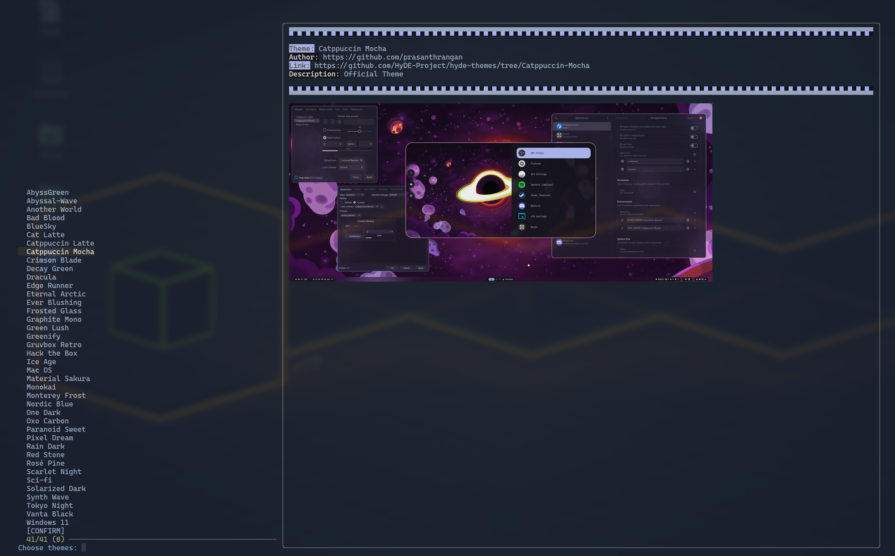

### Vista previa



### Nombre

theme.import.py - Importa temas desde el repositorio de galería de HyDE

### Sinopsis

`theme.import.py` [OPCIONES]

### Descripción

`theme.import.py` es un script para importar y gestionar temas desde el repositorio de galería de HyDE. Permite a los usuarios clonar el repositorio, obtener datos de temas, previsualizar temas y aplicar los temas seleccionados.

### Opciones

- `-j`, `--json`
  Obtener datos JSON después de clonar el repositorio.

- `-S`, `--select`
  Seleccionar temas usando `fzf`.

- `-p`, `--preview` `URL_IMAGEN`
  Obtener una vista previa del tema especificado.

- `-t`, `--preview-text` `TEXTO`
  Texto de vista previa para mostrar cuando se usa la opción `--preview`.

- `--skip-clone`
  Omitir la clonación del repositorio.

- `-f`, `--fetch` `TEMA`
  Obtener y actualizar un tema específico por nombre. Usa `all` para obtener todos los temas ubicados en `xdg_config/hyde/themes`.

### Variables de entorno

- `LOG_LEVEL`
  Establece el nivel de registro (predeterminado: `INFO`).

- `XDG_CACHE_HOME`
  Directorio para archivos de caché (predeterminado: `~/.cache`).

- `XDG_CONFIG_HOME`
  Directorio para archivos de configuración (predeterminado: `~/.config`).

- `FULL_THEME_UPDATE`
  Sobrescribe los archivos archivados (útil para actualizaciones y cambios en archivos).

### Ejemplos

Abre el menú fzf y selecciona temas.

```shell
theme.import.py --select
```
